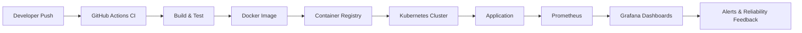

<h2 align="center"> Hola, Geeks! </h2>
<h1 align="center">I'm Hennour Anass👨‍🎤</h1>
<h3 align="center">
  DevOps Engineer ⚙️| Linux • Containers • Orchestration • IaC • Cloud • CI/CD • Monitoring

</h3>

  

---

## 🌐 Connect with me

<b>Open to DevOps / Cloud / Platform Engineering opportunities.</b>

## ⚙ Tech Stack

---

## 🚀 Currently Learning / Roadmap

- Deepening Kubernetes production operations (security, scaling, reliability).
- Advancing GitOps workflows with progressive delivery practices.
- Strengthening AWS architecture and cost-optimization strategies.
- Building end-to-end observability and SRE-focused monitoring patterns.

---

## 📊 GitHub Insights

  
  

  

  

---

## 🧭 CI/CD + Monitoring Reference Architecture

---

<b>
⭐ Automate everything • Ship reliably • Keep learning
</b>

