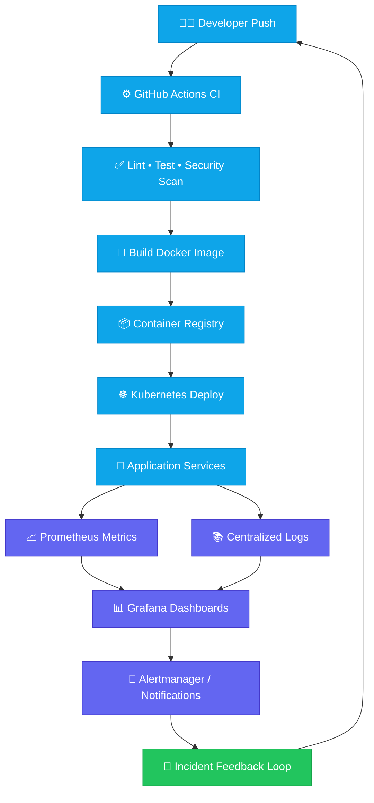

  
  
  

## 🌐 Let’s Connect

  
  

<b>Open to DevOps / Cloud / Platform Engineering opportunities (Remote • Hybrid • On-site).</b>

---

## ⚙️ Tech Stack

  

---

## 🚀 Currently Learning / Roadmap

  
<b>2026 Growth Plan (click to expand/collapse)</b>

   

  - [ ] **Kubernetes at scale:** policy-as-code, workload hardening, and multi-cluster ops.
  - [ ] **GitOps maturity:** Argo CD progressive delivery + rollback playbooks.
  - [ ] **Cloud optimization:** AWS Well-Architected + cost observability patterns.
  - [ ] **SRE practices:** SLO/SLI design, actionable alerts, and incident response workflows.

  

    
    
    
  

---

## 📊 GitHub Insights

  
  

  

  

---

## 🧭 CI/CD + Monitoring Architecture (Interactive)

  
<b>Open Architecture Diagram</b>

   

---

  

